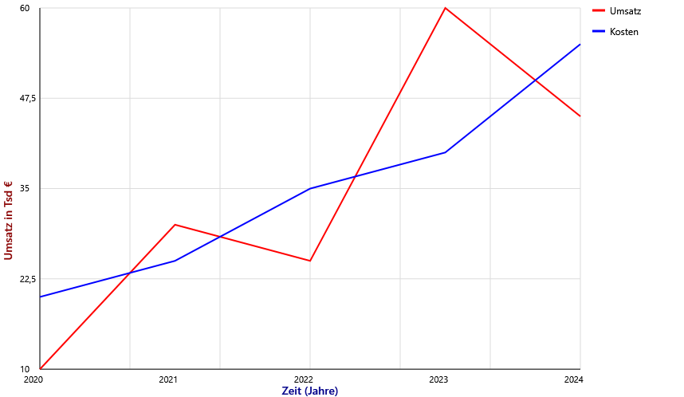
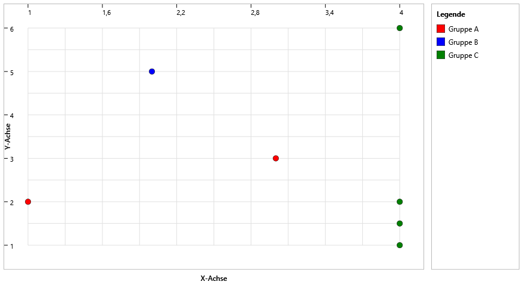

# Chart Controls in WPF für NET

Das Projekt soll Beispielcode und Anleitungen für die Verwendung von Chart Controls in WPF-Anwendungen bereitstellen, die auf dem NET 10 basieren. Die Chart Controls sind ohne zusätzliche Bibliotheken in C# erstellt.

Die Chart Controls sind mit absicht einfach gehalten, um die Grundfunktionalitäten zu demonstrieren und können als Ausgangspunkt für komplexere Implementierungen dienen. So können die Chart Controls ohne großen Aufwand komplett als UnserControl in eigene WPF Projekt hinzugefügt werden. Daher sind nur einfache Grundfunktionen vorhanden, plus die Möglichkeit die Charts als PNG Datei zu exportieren.

In einem Demo-Projekt sind die verschiedenen Chart Controls implementiert und können direkt in einer WPF-Anwendung verwendet werden.

Implementierte Diagrammtypen:\
| Diagrammtyp        | Beschreibung                              |
|:--------------------|:-------------------------------------------|
| Line Chart     | Darstellung von Datenpunkten als Linie    |
| Bar Chart     | Darstellung von Daten als Balken          |
| Bar Chart Horizontal | Darstellung von Daten als Balken, horizontal |
| Column Chart  | Darstellung von Daten als Balken, in Kategorien gruppiert |
| Pie Chart      | Darstellung von Daten als Segmente eines Kreises |
| Gantt Chart    | Darstellung von Daten als gefüllte Fläche |
| Treemap Chart    | Darstellung von Daten im Größenverhältnis |
| Headmap Chart    | Darstellung von Daten im Verhältnis der Farbinensität |
| Scatter Chart    | Darstellung von Daten in einem Streuungsdiagramm |

Verschiedene Beispiele der Charts
- Line Chart

- Gantt Chart

- Treemap Chart

- Headmap Chart

- Scatter Chart

## Versionshistorie

- Scatter Chart Control (Streuungsdiagramm) hinzugefügt

- Zu allen Charts wurde eine Tooltip Funktion hinzugefügt.